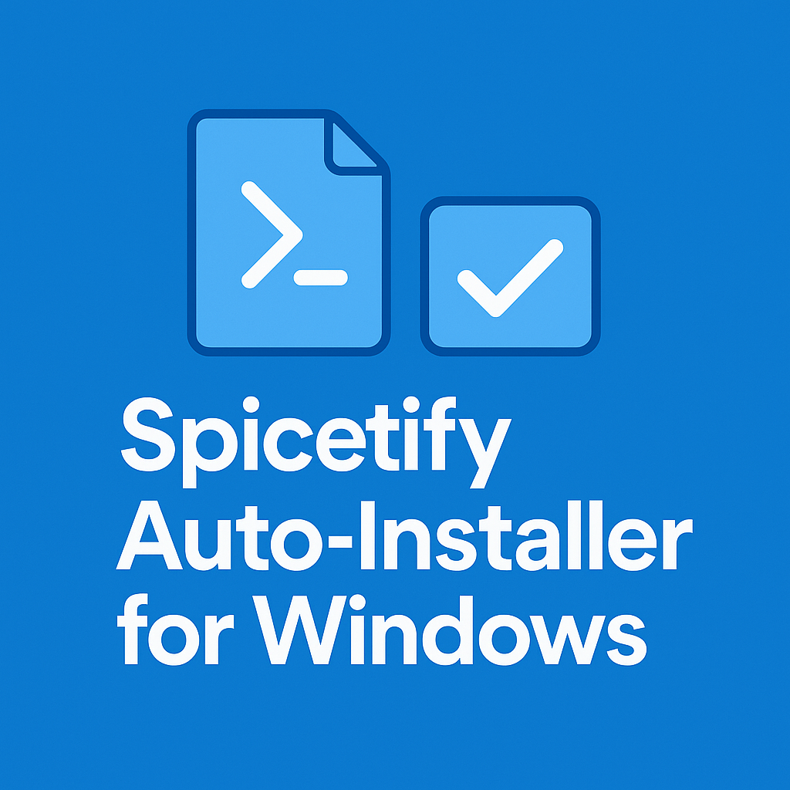

  

---

# Spicetify CLI Auto-Install for Windows

**An automated Batch script for Windows designed to recurrently install and update the Spicetify CLI every time a user logs into their system.**

## 🚀 How It Works

The script automates the following steps to execute the official installation command (`iwr ... | iex`) **silently** on every system startup:

1.  **Script Folder Creation:** It creates a persistent directory at `C:\Scripts`.
2.  **PowerShell Script Creation:** The file `spicetify_install.ps1` containing the official install command is saved to `C:\Scripts`.
3.  **Wrapper Script Creation:** The file `spicetify_start.bat` is created to execute PowerShell **invisibly** (`start /min`).
4.  **Startup Shortcut:** A shortcut (`.lnk`) is placed in the current user's Startup folder.

## 🛠️ Usage

### Project Files

The two main files used in this setup are:

* **Setup Script:** [`setup_autostart.bat`](setup_autostart.bat) (The executable installer)
* **Core Command:** [`spicetify_install.ps1`](spicetify_install.ps1) (The underlying PowerShell command)

### Prerequisites

* Administrator rights for the initial setup.

### Setup Instructions (How to Run)

1.  **Download:** Download the [`setup_autostart.bat`](setup_autostart.bat) file from this repository.

2.  **Execute as Administrator:**
    * Right-click the downloaded `setup_autostart.bat` file and select **"Run as administrator"**.

3.  **MANUAL CONFIRMATION (Batch Prompt): Type 'Y' and Enter**
    After starting, the console will prompt: **"Do you want to start the installation?"**. Type **Y** to proceed.

4.  **CRITICAL INTERRUPTION (PowerShell): Type 'Y' and Enter**
    Immediately after the batch script continues, a PowerShell window may appear asking to install a **missing component** required for **Spicetify features (such as the Marketplace)**.

    * **You MUST type `Y` and press Enter** to allow the script to proceed. This manual confirmation is mandatory.

5.  **Alternative Execution via Terminal (Drag & Drop):**
    * Open the Command Prompt (`cmd`) or PowerShell **as Administrator**.
    * **Drag the `setup_autostart.bat` file** into the Terminal window.
    * Press **Enter** to run the script (and perform **Steps 3 & 4** if prompted).

6.  **Finished:** The routine is set up. The script will now execute automatically upon every subsequent user login.

---

## ⚠️ Important Notes

> ### **🚨 CRITICAL WARNING: Antivirus/Malwarebytes (False Positive)**
> 
> Your antivirus software (e.g., Malwarebytes) may flag the `setup_autostart.bat` file **ONLY during its initial execution.**
> 
> **Reason:** The script downloads and executes remote code via PowerShell (`iwr ... | iex`), which is often flagged by scanners as **Generic Payload** or **Suspicious Behavior**.
> 
> * **This is a False Positive:** The script performs only the official Spicetify installation command.
> * If you trust the Spicetify source, **you must allow execution** or **add an exclusion** for the `setup_autostart.bat` file in your antivirus program **before starting**.
> * **Important:** This alarm affects **only** the initial setup script, not the recurring automatic startup execution.

### Security

This script executes a command that downloads code from an external server and runs it immediately (`iwr -useb ... | iex`). Ensure you trust the source (Spicetify CLI) before running the automated script, and consider reviewing the contents of the official installation script periodically.

### Uninstallation

To stop the automatic execution, simply delete the created shortcut:

1.  Press `Win` + `R` and type `shell:startup` and press Enter.
2.  Delete the shortcut named **`Spicetify Autostart.lnk`**.
3.  Optionally, you can also delete the `C:\Scripts` folder to remove the script files.

---

## 📜 License

This project is licensed under the **[MIT License](LICENSE)**.
